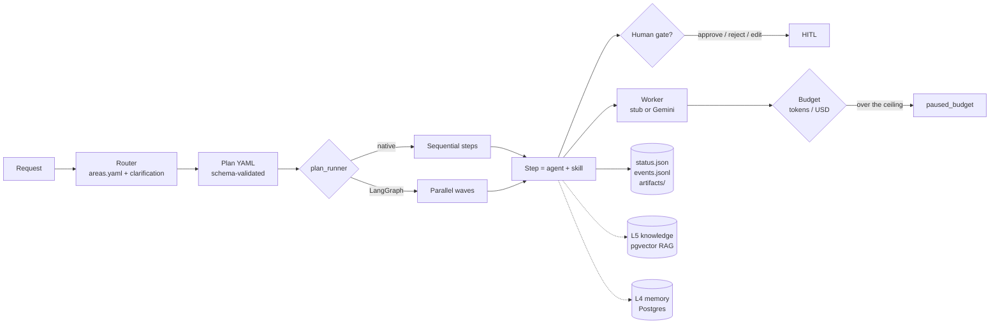

# Network Agents Setup

**A governed runtime for AI agent workflows.** Declarative plans, human approval gates, token and cost budgets, and an append-only audit trail for every run.

[](https://github.com/souzalrns/network-agents-setup/actions/workflows/runner-tests.yml)
[](https://github.com/souzalrns/network-agents-setup/actions/workflows/security-scan.yml)
[](./LICENSE)


> **For recruiters / visitors (60 seconds)**
> - **Portfolio:** [`docs/PORTFOLIO.md`](./docs/PORTFOLIO.md), with a 60-second English summary, the status of each capability, every number with its source, a timeline and a code tour.
> - **Latest work (Oct 2026):** [`docs/portfolio/WHAT-I-CONTRIBUTED.md`](./docs/portfolio/WHAT-I-CONTRIBUTED.md) (document ingestion, web fetch, provenance and validity in retrieval) and its [evidence pack](./docs/portfolio/F6-evidence/README.md).
> - **Run it:** [Quickstart](#quickstart), 5 minutes, no API key, with a GIF of a real run.
> - **Production companion:** [`agent-network-mcp`](https://github.com/souzalrns/agent-network-mcp), the MCP server on Vercel.
> - **What is still open:** [`PENDENCIAS.md`](./docs/initiatives/PENDENCIAS.md), the single source of truth for pending work.
>
> The legacy TypeScript under `packages/` and `apps/` is archived: the live runtime is Python (`runner/`).

> Documentação interna e estado do projecto em português: [`docs/`](./docs/) · pendentes em [`docs/initiatives/PENDENCIAS.md`](./docs/initiatives/PENDENCIAS.md).

---

## What it is

The core of a multi-agent network (LRNSdigital). This repository holds the **engine** (`plan_runner`, Python), the **governance** around it, and the **horizontal capabilities** (agents and skills) that any business domain can plug in. The production entry point is a separate MCP server ([`agent-network-mcp`](https://github.com/souzalrns/agent-network-mcp), on Vercel), which exposes the agents to Claude.ai.

**Design choice:** most agent frameworks optimise for autonomy. This one optimises for **control and evidence**. A run cannot spend past its budget, cannot skip a human gate, and cannot claim to be done without leaving a verifiable record.

## How a run works



## Capabilities

| Capability | What it guarantees | Code |
|---|---|---|
| Declarative plans | Steps, dependencies, artifacts and gates declared in YAML; validated against a JSON Schema | [`plan.schema.json`](./runner/plan_runner/plan.schema.json), [`plan_schema.py`](./runner/plan_runner/plan_schema.py) |
| Two engines | Native (sequential) and LangGraph (independent steps run as parallel waves) | [`engine.py`](./runner/plan_runner/engine.py), [`langgraph_engine.py`](./runner/plan_runner/langgraph_engine.py) |
| Human-in-the-loop | Approve / reject / edit, durable across processes; a run pauses until a human decides | [`hitl.py`](./runner/plan_runner/hitl.py) |
| Crash recovery | `resume` continues from `status.json` after an interruption | [`engine.py`](./runner/plan_runner/engine.py) (`resume_run`) |
| Completion criteria | `done_when` is checked at the end of every run (`<path> exists`, `human_gate_resolved on <step>`); a run whose criteria fail ends as `failed`, not `done` | [`done_when.py`](./runner/plan_runner/done_when.py) |
| Budgets | Token and USD ceilings checked before every model call; fails closed when a price is unknown | [`cost.py`](./runner/plan_runner/cost.py), [`external_worker.py`](./runner/plan_runner/external_worker.py), [`BUDGET.md`](./docs/ops/BUDGET.md) |
| Token ledger | One row per model call (tokens in/out, model, run, step) | [`external_worker.py`](./runner/plan_runner/external_worker.py) |
| Model tiers | Planner / executor / verifier tier per step | [`model_tiers.py`](./runner/plan_runner/model_tiers.py) |
| Router | Maps a free-text request to an area and agent, with bounded clarification rounds | [`router.py`](./runner/plan_runner/router.py), [`areas.yaml`](./config/areas.yaml) |
| Council | Multi-agent deliberation: independent positions, anonymous peer ranking, chairman synthesis, human sign-off | [`council_session.py`](./runner/plan_runner/council_session.py), [`councils.yaml`](./config/councils.yaml) |
| L4 memory | Persistent memory in Postgres + pgvector; candidates promoted only through human approval | [`memory_l4.py`](./runner/plan_runner/memory_l4.py) |
| L5 knowledge | Incremental RAG ingest (content hash, only changed files are re-embedded) and retrieval through the MCP server | [`ingest_apply.py`](./scripts/ingest_apply.py), [`knowledge_wiring.py`](./runner/plan_runner/knowledge_wiring.py) |
| Config validation | Areas, agents, councils and capabilities validated in CI | [`areas.py`](./runner/plan_runner/areas.py) |
| Skill usage | Every `step_started` event records which skill file the step loaded, so skill usage is measured from the audit log | [`skills.py`](./runner/plan_runner/skills.py) (`skill_ref`) |

**Domain packs, not special agents.** 38 agents and about 70 skills (Markdown) are organised by domain (marketing, design, engineering, security, meta…). A domain plugs in through `config/areas.yaml` and plan templates in [`docs/orchestration/`](./docs/orchestration/), without changing the engine.

## Engineering quality

Everything below can be checked in the repository and its Actions history:

- **830+ automated tests** (pytest; 836 on 2026-10-07), plus 195 TypeScript unit tests (vitest), including an ingest → retrieve test against a disposable Postgres + pgvector, and slow end-to-end runs of real plans. See [`runner-tests.yml`](./.github/workflows/runner-tests.yml).
- **Security on every PR:** gitleaks, semgrep and CodeQL. Every GitHub Action is pinned to a commit SHA.
- **100 merged pull requests**, each with its evidence and test output. Architectural decisions are recorded as ADRs ([`docs/architecture/adr/`](./docs/architecture/adr/)). Every open choice is logged with options A/B/C and a recommendation ([`PENDENCIAS.md`](./docs/initiatives/PENDENCIAS.md) §10).

### Selected engineering stories

| Problem | How it was found | Fix |
|---|---|---|
| Retrieval read a table that ingestion never wrote to: the RAG was "done" only on paper | Audit of the full write → read path | Canonical knowledge table (#31) |
| Ingestion re-embedded the same 10 files on every run and never reached 28 others | Revalidation against the ingestion manifest | Content-hash incremental ingest (#64). Production runs now log `chunks=0 unchanged=39` |
| The CI job could never fail (a pipeline without `pipefail`) | A failing test that still came out green | `pipefail` enabled (#36) |
| A token-saving optimisation looked like it had failed: −2.6% measured vs −16% projected | Token-by-token prompt comparison: the "optimised" arm had run the legacy prompt | Corrected re-run: **−22% measured** (#45, #55) |

## Domain showcase: a multi-agent marketing agency

The first domain pack built on this core. Horizontal specialists (SEO, AI Visibility, UI/UX, copy, media, UGC…) are coordinated by an orchestrator that plans and hands off work but never replaces the specialist. Each role keeps its prompt separate from its knowledge (checklists and anti-patterns per role).

| Document | Contents |
|---|---|
| [`docs/PORTFOLIO-MARKETING.md`](./docs/PORTFOLIO-MARKETING.md) | Full narrative of the marketing pack: problem, solution, diagram, differentiators (PT) |
| [`docs/ONE-PAGER-MARKETING-AGENTS.md`](./docs/ONE-PAGER-MARKETING-AGENTS.md) | One-page summary |
| [`docs/marketing-agency-agents.md`](./docs/marketing-agency-agents.md) | System prompts and limits for every agent |
| [`docs/item-13-ai-findability.md`](./docs/item-13-ai-findability.md) | AI Visibility playbook (SEO + GEO + AEO + LLMO; internal name "Item 13") |
| [`docs/knowledge/`](./docs/knowledge/) | Knowledge packs per specialty, ingested into the RAG |
| [`docs/CONCLUSAO-SETUP-MARKETING.md`](./docs/CONCLUSAO-SETUP-MARKETING.md) | Close-out and next steps |

## Quickstart


*Real output of the commands below (stub mode, no API key).*

```bash
git clone https://github.com/souzalrns/network-agents-setup
cd network-agents-setup/runner
pip install -r requirements.txt            # + requirements-langgraph.txt for the LangGraph engine

# Run a demo plan without calling any model (stub mode). It pauses at a human gate.
python -m plan_runner run ../docs/orchestration/marketing/templates/examples/seo-article-demo.plan.yaml \
  --mode stub --out ../pilots/demo

# Approve the gate and finish the run
python -m plan_runner resume ../pilots/demo --decision approve
```

Inspect `../pilots/demo/status.json` (final state), `events.jsonl` (the full audit log) and `artifacts/`. Full CLI reference: [`runner/README.md`](./runner/README.md).

## Repository map

| Path | Status | Contents |
|---|---|---|
| [`runner/`](./runner/) | **Active** | `plan_runner` engine and its tests |
| [`agents/`](./agents/), [`skills/`](./skills/) | **Active** | Horizontal agents and skills, by domain |
| [`.claude/skills/`](./.claude/skills/) | **Generated** | Technique skills (`skills/meta` + `skills/claude`) loadable in Claude Code sessions; regenerated by [`sync_claude_skills.py`](./scripts/sync_claude_skills.py) and checked in CI |
| [`config/`](./config/) | **Active** | Areas, councils, capabilities, model tiers and prices |
| [`docs/orchestration/`](./docs/orchestration/) | **Active** | Plan templates per domain |
| [`scripts/`](./scripts/) | **Active** | RAG schema, ingestion, migrations |
| [`docs/`](./docs/) | **Active** (PT) | Architecture, ADRs, operations, open items |
| [`packages/`](./packages/), [`apps/`](./apps/), [`k8s/`](./k8s/), `Dockerfile`, `docker-compose.yml` | **Archived** | Earlier TypeScript runtime, replaced by `plan_runner` (decision D1). Kept for history; CI still builds it |

## Status

- **Operational and tested:** the runtime and everything listed under Capabilities.
- **In progress:** revalidation of the knowledge layer (phase F0). An [ingestion-primitives ADR](./docs/architecture/adr/ADR-INGESTION-PRIMITIVES.md) has been accepted.
- **Not built yet:** an identity and authorization layer (delegation graph, action receipts). It is designed in [ADR-001](./docs/architecture/adr/ADR-001-governance-runtime.md) and not implemented.
- **Plan:** [`EXECUTION-PLAN.md`](./docs/architecture/EXECUTION-PLAN.md) (Universal Core → Domain Packs). **Open work:** [`PENDENCIAS.md`](./docs/initiatives/PENDENCIAS.md).

### Architecture references (PT)

| Document | Contents |
|---|---|
| [`ECOSYSTEM.md`](./docs/architecture/ECOSYSTEM.md) | How this repo and the production MCP server fit together |
| [`MCP-MAPPING.md`](./docs/architecture/MCP-MAPPING.md) | The agents of `agent-network-mcp`: horizontals migrated here, verticals kept there |
| [`CORE-MAPPING.md`](./docs/architecture/CORE-MAPPING.md) | Module-by-module inventory of the archived TypeScript core |
| [`ROADMAP-GOVERNANCE.md`](./docs/architecture/governance/ROADMAP-GOVERNANCE.md) | Governance layer roadmap |
| [`estrutura-geral-agentes.md`](./docs/estrutura-geral-agentes.md) | Overall agent structure specification |

## License

[MIT](./LICENSE) · LRNSdigital
