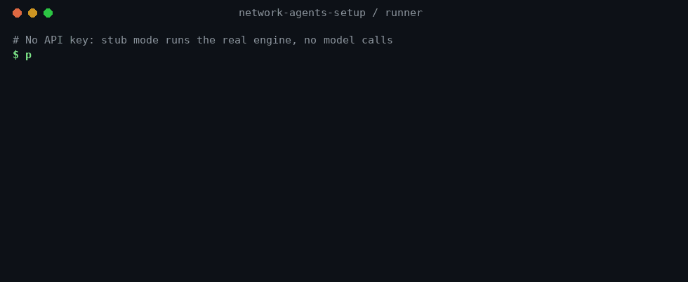

# Portfólio: plataforma de agentes com governação

> **English summary (60 seconds)**
>
> **What it is.** A governed runtime for AI agent workflows. One Python execution engine (`plan_runner`) runs declarative YAML plans step by step. It enforces human approval gates, token and cost ceilings, and completion criteria, and writes an append-only audit log for every run. Business domains (marketing, security, engineering…) plug in as **domain packs**: agents, skills, plans and knowledge, with no change to the engine.
>
> **Proof you can check.**
> - 590+ automated tests in CI;
> - 75+ merged pull requests, each with evidence;
> - security scanning on every PR (gitleaks, semgrep, CodeQL), with Actions pinned by SHA;
> - token usage measured on real model runs: 10,136 tokens for a multi-step SEO plan, 11,760 for one round of a multi-agent council.
>
> **What it is not (yet).** Agents do not execute tools, and the knowledge layer's provenance is still partial. Only the marketing and security packs are exercised end to end. Every open item is tracked publicly in [`PENDENCIAS.md`](./initiatives/PENDENCIAS.md).
>
> **Try it in 5 minutes, without an API key:** see [Quickstart](#quickstart) below.

---

## Problema

Quem adopta uma stack "multi-agente" acaba muitas vezes num de dois sítios:

- **custo e controlo sem limite:** agentes que chamam modelos sem tecto de tokens, sem aprovação humana e sem registo do que fizeram;
- **uma pilha de prompts:** cada domínio com o seu framework, sem um motor de execução comum, sem testes e sem segurança de base.

## Solução

**Um só motor de execução** (`plan_runner`, Python) e domínios que se ligam a ele, em vez de um framework novo por domínio.

- Um **plano YAML**, validado contra um JSON Schema, declara passos, dependências, artefactos, gates humanos e critérios de conclusão.
- O **motor** corre os passos (sequencial ou em ondas paralelas com LangGraph) e aplica as garantias:
  - pausa no gate humano;
  - pára no tecto de tokens ou de custo;
  - só declara `done` se os critérios de conclusão passarem.
- Cada **domain pack** traz agentes, skills, planos e conhecimento, e consome o motor sem o mudar.

**Escolha de desenho:** a maioria dos frameworks de agentes optimiza a autonomia. Este optimiza o **controlo e a evidência**.

## Arquitectura

```text
Pedido → Router (área → agente ou plano)
       → Plano YAML (schema validado)
       → plan_runner (nativo | LangGraph)
            → passo = agente + skill → worker (stub | Gemini)
            → gate humano · tecto de tokens/custo · done_when
            → status.json · events.jsonl · artifacts/
       → (opcional) memória L4 (Postgres) · conhecimento L5 (pgvector, via MCP)
```

Repo companheiro: [`agent-network-mcp`](https://github.com/souzalrns/agent-network-mcp), o servidor MCP em produção (Vercel) que expõe os agentes ao Claude.ai e serve o retrieve do conhecimento.

## O que corre hoje

| Capacidade | Estado | Onde |
|---|---|---|
| Planos declarativos com schema | Operacional; 14 planos no repo validados no CI | [`plan.schema.json`](../runner/plan_runner/plan.schema.json) |
| 2 engines (nativo e LangGraph) | Operacional | [`engine.py`](../runner/plan_runner/engine.py), [`langgraph_engine.py`](../runner/plan_runner/langgraph_engine.py) |
| Gates humanos (approve / reject / edit) e `resume` | Operacional | [`hitl.py`](../runner/plan_runner/hitl.py) |
| Tectos de tokens e de custo, com pausa `paused_budget` | Operacional | [`BUDGET.md`](./ops/BUDGET.md) |
| Critérios de conclusão (`done_when`) | Operacional desde 2026-10-05 (#90, #96) | [`done_when.py`](../runner/plan_runner/done_when.py) |
| Worker Gemini com tokens medidos | Medido em runs reais de SEO | [`WORKER-EXTERNAL.md`](./ops/WORKER-EXTERNAL.md) |
| Conselho multi-agente (posições, ranking anónimo, síntese, sign-off humano) | 1 ronda real medida | [`COUNCIL.md`](./ops/COUNCIL.md) |
| Router (texto livre → área → agente) | Operacional; avaliação com o modelo real por fazer (W-001) | [`router.py`](../runner/plan_runner/router.py) |
| Memória L4 (Postgres + pgvector, promoção com aprovação humana) | Código e testes; teste real pela CLI por fazer (L4-1b) | [`MEMORY-L4.md`](./ops/MEMORY-L4.md) |
| Conhecimento L5 (RAG) | Ingest incremental em produção; revalidação (F0) quase fechada; provenance formal no F3 | [`RAG-CANONICAL.md`](./ops/RAG-CANONICAL.md) |
| Pack de segurança (triage → audit → report) | Testado em stub; run real com modelo por fazer (F5) | [`security-audit-demo.plan.yaml`](./orchestration/security/templates/examples/security-audit-demo.plan.yaml) |

## Prova

Tudo o que está abaixo se confirma no repositório e no histórico do GitHub Actions.

- **590+ testes automáticos** (pytest), incluindo:
  - ingest → retrieve contra um Postgres + pgvector descartável;
  - runs lentos de planos reais de ponta a ponta.

  Ver [`runner-tests.yml`](../.github/workflows/runner-tests.yml).
- **Segurança em cada PR:** gitleaks, semgrep e CodeQL. Todas as GitHub Actions estão presas a um SHA de commit. Ver [`security-scan.yml`](../.github/workflows/security-scan.yml).
- **Tokens medidos, não estimados:**

  | Run | Tokens |
  |---|---|
  | Plano de SEO de vários passos | 10 136 |
  | 1 ronda de conselho | 11 760 |

  Uma optimização que parecia ter falhado (−2,6%) deu **−22%** depois de corrigido o braço de teste (#45, #55).
- **Ingest incremental:** só os ficheiros alterados voltam a ser embedados (#64). As corridas em produção registam `chunks=0 unchanged=39` quando nada mudou.
- **Governação:**
  - um único ficheiro de pendentes ([`PENDENCIAS.md`](./initiatives/PENDENCIAS.md)), com dono, severidade e evidência por item;
  - ADRs em [`docs/architecture/adr/`](./architecture/adr/);
  - cada escolha aberta em opções A/B/C com recomendação;
  - 75+ PRs com merge, cada um com a sua evidência.

### Histórias de engenharia

| Problema | Como foi encontrado | Correcção |
|---|---|---|
| O retrieve lia uma tabela onde o ingest nunca escrevia: o RAG estava "feito" só no papel | Auditoria do caminho escrita → leitura | Tabela canónica de conhecimento (#31) |
| O job de CI nunca falhava (pipeline sem `pipefail`) | Um teste a falhar que saía verde | `pipefail` activado (#36) |
| Uma optimização de tokens parecia falhada (−2,6% medido contra −16% previsto) | Comparação do prompt token a token: o braço "optimizado" tinha corrido o prompt antigo | Re-run corrigido: **−22% medido** (#45, #55) |
| Um plano podia declarar-se `done` sem os seus próprios critérios de conclusão | Auditoria dos campos de plano que o motor ignorava | `done_when` verificado no fim do run, nos 2 engines (#90) |

## Quickstart



*Saída real dos comandos abaixo.* Sem chave de API: o modo `stub` não chama nenhum modelo.

```bash
git clone https://github.com/souzalrns/network-agents-setup
cd network-agents-setup/runner
pip install -r requirements.txt

# Corre um plano de demonstração; pára num gate humano
python -m plan_runner run ../docs/orchestration/marketing/templates/examples/seo-article-demo.plan.yaml \
  --mode stub --out ../pilots/demo

# Aprova o gate e termina o run
python -m plan_runner resume ../pilots/demo --decision approve
```

Para ver o resultado:
- `../pilots/demo/status.json`: o estado final (`done`);
- `events.jsonl`: o registo completo do run;
- `artifacts/`: o que cada passo produziu.

O worker real (Gemini) e a CLI completa estão em [`runner/README.md`](../runner/README.md).

## Decisões de desenho

| Escolha | Porquê |
|---|---|
| Um só runtime | Evitar um 2.º "cérebro" por domínio (o core TypeScript anterior está arquivado, decisão D1) |
| Gates humanos e tectos de tokens por omissão | Agentes sem controlo de custo nem aprovação são demos |
| Capabilities antes de mais agentes | O pack de segurança é o modelo; um domínio novo entra por configuração |
| Dois repos | Orquestração e governação aqui; a superfície MCP de produção no `agent-network-mcp` |
| Repo público com higiene de segredos | gitleaks no CI, lista de ficheiros proibidos aos agentes, nenhum segredo em prompts |

## O que não afirmamos

- **Não** é uma plataforma "enterprise" completa: é um runtime orientado a produção, com as lacunas listadas.
- **Os agentes não executam tools:** o `tools_allowed` é declarativo (AU-20).
- **Nem todos os packs estão provados:** o marketing (SEO) foi medido com o modelo real; o de segurança está testado em stub. Ter 38 agentes e 72 skills não quer dizer 38 capacidades prontas.
- O TypeScript em `packages/` e `apps/` está **arquivado**: não é o runtime.
- O conhecimento L5 ainda não tem provenance formal nem filtro por `kb` no retrieve (F3, R-005).

## Domínios

- **Marketing (1.º domínio):** agência multi-agente com papéis limitados, knowledge packs e o playbook de descoberta por IA. Ver [`PORTFOLIO-MARKETING.md`](./PORTFOLIO-MARKETING.md).
- **Segurança defensiva:** pipeline triage → audit → report com capabilities declaradas. É o modelo para os próximos domínios.

---

GitHub: [souzalrns](https://github.com/souzalrns) · Documentação interna em português · Licença [MIT](../LICENSE)
