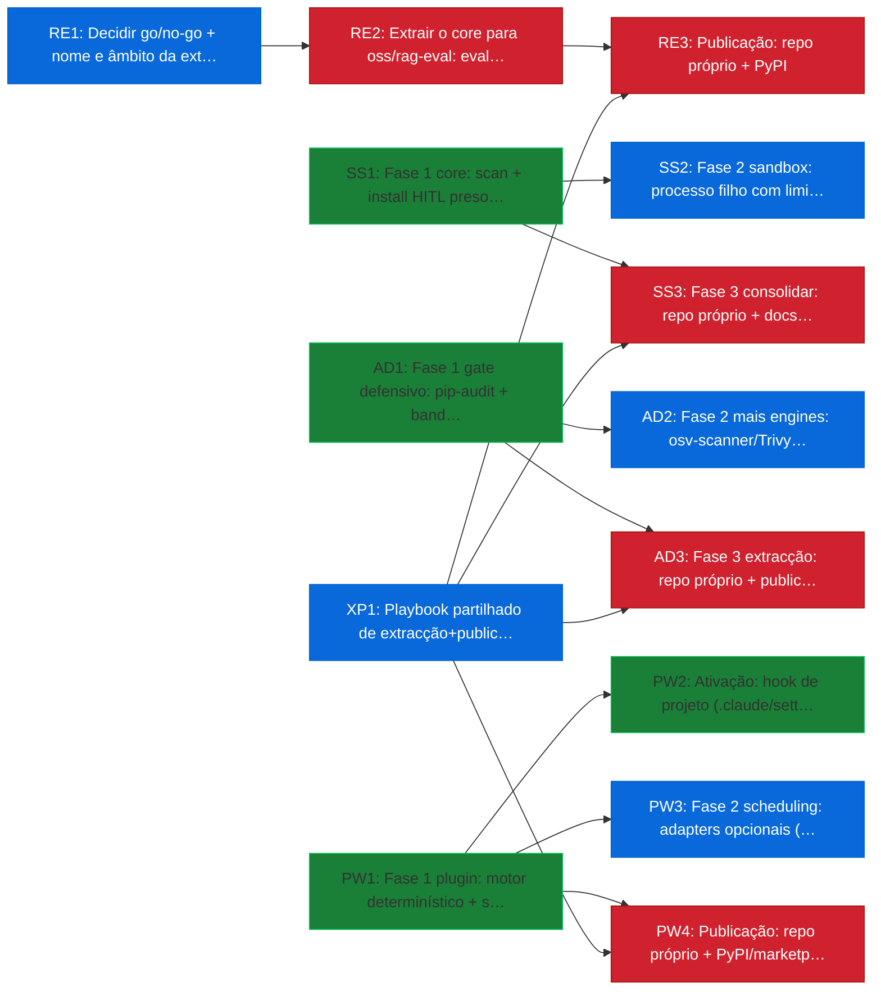
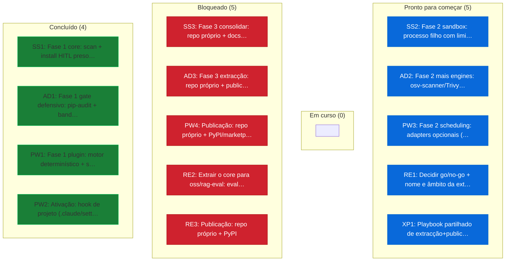

# Planos dos projetos autónomos

> Planeado com o **planwright** (`oss/planwright/`), dogfood: o plano dos quatro
> projetos acopláveis é ele próprio um plano planwright, validado pelo motor.
> Fonte de verdade única: a **tabela mestra** abaixo (a 1.ª tabela do ficheiro é
> a que o planwright lê). As secções por projeto são vistas de leitura; não
> duplicam estado.
>
> **Validação (reproduzir):**
> `PYTHONPATH=oss/planwright/src python3 -m planwright.cli validate docs/initiatives/PLANOS-AUTONOMOS.md --strict`
> `PYTHONPATH=oss/planwright/src python3 -m planwright.cli graph docs/initiatives/PLANOS-AUTONOMOS.md`

## Tabela mestra (os 4 projetos, por `Track`)

Estados: `done` (feito/merged) · `doing` (em curso) · `blocked` (espera por ação
externa, ex. repo/PyPI do DEV) · `todo`. Estimativas em esforço (`S`=½d, `M`=2d,
`L`=1 semana, `XL`=2 semanas). `Done-when` é coluna extra — o planwright **ignora-a**
(valida IDs/estados/dependências/ciclos); viaja para leitura humana.

Colunas extra: **Autonomy** (`auto` o agente fecha sozinho · `assisted` · `human`
precisa de decisão/ação humana) e **Complexity** (`C1`..`C4` = risco cognitivo,
para futuro roteamento barato→caro, **independente** do esforço). O planwright
lê-as se presentes e ignora-as se ausentes.

| ID | Title | Status | Owner | Est | Autonomy | Complexity | Depends | Track | Done-when |
|----|-------|--------|-------|-----|----------|------------|---------|-------|-----------|
| SS1 | Fase 1 core: scan + install HITL preso ao hash + ciclo de vida + ~80 agentes + SARIF + pacote publicável + CI | done | claude | L | auto | C2 | - | skill-scout | Merged (#143); 169 testes; CI 17/17; SARIF no code scanning |
| SS2 | Fase 2 sandbox: processo filho com limites de CPU/memória/ficheiros/rede + testes de comportamento | todo | claude | L | auto | C3 | SS1 | skill-scout | Uma skill hostil é contida; testes negativos provam cada limite; doc SKILL-SCOUT.md §4; CI verde |
| SS3 | Fase 3 consolidar: repo próprio + docs + CI próprio + publicação no PyPI | blocked | ambos | M | human | C2 | SS1, XP1 | skill-scout | pip install skill-scout do PyPI; repo próprio com CI verde; README autónomo (repo/PyPI = ação do DEV) |
| AD1 | Fase 1 gate defensivo: pip-audit + bandit + zizmor → 1 relatório JSON+SARIF + política + CLI + CI | done | claude | M | auto | C2 | - | auditron | Merged (#156); 25 testes; build + twine --strict; CI verde |
| AD2 | Fase 2 mais engines: osv-scanner/Trivy (via SEC-SCA-2) + engine de segredos + wrapper MCP para agentes chamarem o scan | todo | claude | L | auto | C3 | AD1 | auditron | osv-scanner/Trivy fixados por versão+checksum; engine de segredos; tool MCP expõe scan; testes + CI verdes |
| AD3 | Fase 3 extracção: repo próprio + publicação no PyPI | blocked | ambos | M | human | C2 | AD1, XP1 | auditron | pip install auditron do PyPI; repo próprio com CI verde (repo/PyPI = ação do DEV) |
| PW1 | Fase 1 plugin: motor determinístico + skill governed-planning + hook + slash commands | done | claude | L | auto | C3 | - | planwright | Merged (#157); 35 testes; claude plugin validate passa; CI verde |
| PW2 | Ativação: hook de projeto (.claude/settings.json) ativo no NAS | done | ambos | S | assisted | C2 | PW1 | planwright | #158 merged; o hook bloqueia um PLAN.md inválido numa sessão real |
| PW3 | Fase 2 scheduling: adapters opcionais (workalendar; OR-Tools/PyJobShop; Mermaid gantt) + roll-up multi-plano + wrapper MCP; core fica zero-dep | todo | claude | XL | auto | C4 | PW1 | planwright | planwright[schedule] dá datas+nivelamento; pip install planwright continua 0-dep; testes + CI verdes |
| PW4 | Publicação: repo próprio + PyPI/marketplace | blocked | ambos | M | human | C2 | PW1, XP1 | planwright | pip install planwright do PyPI; plugin instalável por marketplace (repo/PyPI = ação do DEV) |
| RE1 | Decidir go/no-go + nome e âmbito da extracção do l5_eval para projeto autónomo | todo | maestro | S | human | C4 | - | rag-eval | Decisão §10 (go/no-go + nome, ex. rag-eval) registada; spec de âmbito escrita |
| RE2 | Extrair o core para oss/rag-eval: eval de golden set + métricas provenance_ok/source_hit + backend plugável (sem depender do plan_runner) | blocked | claude | L | auto | C3 | RE1 | rag-eval | oss/rag-eval build + testes + CLI rag-eval run/validate; sem import de plan_runner; backend abstraído; CI verde |
| RE3 | Publicação: repo próprio + PyPI | blocked | ambos | M | human | C2 | RE2, XP1 | rag-eval | pip install rag-eval do PyPI; repo próprio com CI verde |
| XP1 | Playbook partilhado de extracção+publicação: scaffold de repo próprio + CI + passos PyPI, reutilizado pelos 4 | todo | ambos | M | assisted | C2 | - | shared | Doc do playbook + scaffold; validado na 1.ª extracção real |

## Vista de gestão (gerada pelo planwright)

> Gerada por `scripts/regen_planos_visual.py` a partir da tabela mestra.
> **Não editar à mão** — correr o script; o CI falha se divergir da tabela.
> Os diagramas Mermaid renderizam no GitHub.

### Grafo de dependências (o que prende o quê · cor = estado)



### Board por estado (Kanban)



### Plano de ação (`planwright action`)

```
## Agora (pronto, por ordem de alavancagem)
  1. [C4][human] RE1  Decidir go/no-go + nome e âmbito da extracção do l5_eval para projeto autónomo  (4h @maestro) · destrava 2 a jusante (7d)
  2. [C4][auto] PW3  Fase 2 scheduling: adapters opcionais (workalendar; OR-Tools/PyJobShop; Mermaid gantt) + roll-up multi-plano + wrapper MCP; core fica zero-dep  (10d @claude) ★crítico
  3. [C2][assisted] XP1  Playbook partilhado de extracção+publicação: scaffold de repo próprio + CI + passos PyPI, reutilizado pelos 4  (2d @ambos) · destrava 4 a jusante (8d)
  4. [C3][auto] AD2  Fase 2 mais engines: osv-scanner/Trivy (via SEC-SCA-2) + engine de segredos + wrapper MCP para agentes chamarem o scan  (5d @claude)
  5. [C3][auto] SS2  Fase 2 sandbox: processo filho com limites de CPU/memória/ficheiros/rede + testes de comportamento  (5d @claude)

## Bloqueadas → quem destrava
  SS3 <- XP1
  AD3 <- XP1
  PW4 <- XP1
  RE2 <- RE1
  RE3 <- RE2, XP1

## Autónomas nesta onda (Autonomy=auto, prontas)
  PW3, AD2, SS2

## Crítico: 15d — PW1 -> PW3
  (encurtar o plano = atacar esta cadeia)
```

## Vistas por projeto

### 1. skill-scout — Fase 1 ✅; falta sandbox + PyPI
- **SS1 (done)** — core completo: #143 merged, 169 testes, SARIF no code scanning. Evidência: `oss/skill-scout/`, PENDENCIAS SKILL-SCOUT-1 (FECHADO).
- **SS2 (todo)** — sandbox dos scripts + testes de comportamento (o "diferenciar" da Fase 2). Base: `docs/ops/SKILL-SCOUT.md` §4. Corre em paralelo com SS3.
- **SS3 (blocked)** — consolidar e publicar no PyPI; depende de SS1 + do playbook XP1. Repo/PyPI são ação pública do DEV.

### 2. auditron — Fase 1 ✅; falta PyPI
- **AD1 (done)** — gate defensivo: #156 merged, 25 testes. Evidência: `oss/auditron/`.
- **AD2 (todo)** — mais engines + wrapper MCP (a Fase 2 de valor). Independente da publicação.
- **AD3 (blocked)** — publicar a Fase 1 no PyPI; depende de AD1 + XP1 (não precisa da Fase 2). Repo/PyPI = ação do DEV.

### 3. planwright — Fase 1 ✅; falta ativação (#158)
- **PW1 (done)** — plugin em camadas: #157 merged, 35 testes.
- **PW2 (doing)** — ativação do hook de projeto; **#158 aberto, à espera de merge**.
- **PW3 (todo)** — Fase 2 "integrar, não reconstruir" (adapters opcionais; ver `oss/planwright/POSITIONING.md`). Caminho crítico do conjunto.
- **PW4 (blocked)** — publicar; depende de PW1 + XP1.

### 4. rag-eval (ex-l5_eval) — candidato futuro; por começar
- **RE1 (todo)** — **gate de decisão**: o `l5_eval` existe (`runner/plan_runner/l5_eval.py`), mas extraí-lo/renomeá-lo para um projeto autónomo ainda **não é decisão tomada**. RE1 regista go/no-go + nome (o Claude propõe, não assume — regra do maestro).
- **RE2 (blocked)** — extrair o core desacoplado do `plan_runner`, com backend plugável (hoje o `run` exige MCP_URL+MCP_API_KEY; o `validate` é offline).
- **RE3 (blocked)** — publicar.

## Dependências entre projetos

Os quatro são, no essencial, **independentes e paralelos** — isso é uma
vantagem: o caminho crítico vive *dentro* de cada projeto, não entre eles. A
única dependência cruzada real é o **playbook de extracção+publicação (XP1)**, de
que as fases de publicação dos quatro (SS3, AD3, PW4, RE3) dependem, para não
reinventar a publicação quatro vezes.

## Ambiguidades (A/B/C + recomendação)

**1. Um plano por projeto vs. uma tabela mestra.**
- **A (RECOMENDADA):** uma tabela mestra única (Track = projeto), + vistas em prosa. Razão: é a única forma de o planwright validar as dependências *entre* projetos sem as marcar como inexistentes (dangling); e é o ADN do planwright (uma fonte de verdade).
- B: 4 tabelas separadas — legível, mas o planwright não valida deps cruzadas.
- C: 4 ficheiros `.plan.md` — idem B + fragmenta o estado.

**2. Playbook de extracção+publicação partilhado (XP1).**
- **A (RECOMENDADA):** criar XP1 partilhado; as 3+1 fases de publish dependem dele. Razão: DRY + padrão ouro; cria a dependência cruzada real; custo baixo (doc + scaffold). *(Elevação proposta — vetável.)*
- B: cada projeto documenta a sua publicação (duplicação).
- C: sem playbook (ad hoc).

**3. `done_when` não tem coluna nativa no planwright.**
- **A (RECOMENDADA):** coluna extra `Done-when` que o motor ignora (valida estrutura/deps/ciclos; o critério viaja para humanos). Razão: zero mudança ao planwright, tudo numa tabela.
- B: `done_when` em prosa separada (desliga-o do grafo).
- C: estender o planwright para suportar `done_when` nativo — é scope creep (candidato à Fase 2 do planwright, PW3).

**4. `rag-eval` ainda não é decisão tomada.**
- **A (RECOMENDADA):** entra como projeto, com RE1 = "decidir go/no-go + nome" como gate (todo); tudo o resto fica `blocked` em RE1. Razão: respeita "não cortar pedidos" sem assumir uma decisão por tomar (o Claude propõe).
- B: deixar `rag-eval` fora até haver decisão.
- C: assumir decidido e começar a extrair.

## Limitações do planwright observadas (documentadas)

- **Sem coluna `done_when` nativa** → resolvido pela coluna extra ignorada (ambiguidade 3A). Candidato a melhoria na Fase 2 (PW3).
- **Lê só a 1.ª tabela `ID`+`Title` do ficheiro** → por isso a tabela mestra é a primeira e única tabela; as vistas por projeto são listas, não tabelas.
- **Estimativas são esforço, não calendário** (sem datas/disponibilidade) → por desenho; é exatamente o que a Fase 2 (PW3) integra via adapters.
- **Formato diferente do `PENDENCIAS.md`** (10 colunas, sem `Depends`) → o `PENDENCIAS` não é validável tal-qual pelo planwright; manter os dois até alinhar o formato (seguimento do PLANWRIGHT-1).
